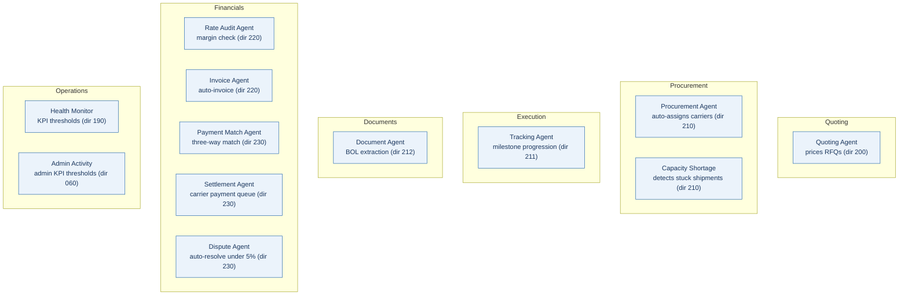
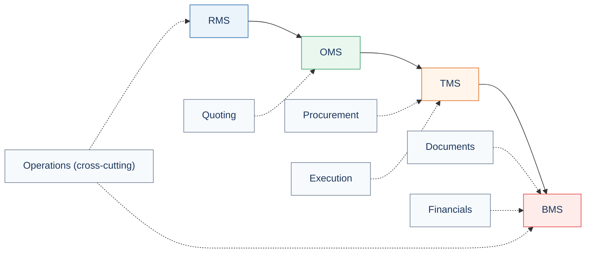

# ShipCES Autonomous Brokerage - agent map

The 12 operational agents in the `AGENT_REGISTRY` (`services/carrier/src/api/router.ts`,
served at `GET /api/v1/agents`), grouped by department. These are the Phase-V
operational plane; they run over the four-layer RMS/OMS/TMS/BMS domain plane
([architecture](architecture-c4.md)). Labels, departments, schedules and
directive numbers are taken verbatim from the registry.

## Agents by department

## Which layer each department serves

## Registry reference

| Agent | Department | Type | Directive | Audit prefix |
|---|---|---|---|---|
| Quoting Agent | quoting | pricing | 200 | `rfq.` |
| Procurement Agent | procurement | assignment | 210 | `agent.procurement.` |
| Tracking Agent | execution | simulation | 211 | `agent.tracking.` |
| Document Agent | documents | validation | 212 | `agent.document.` |
| Rate Audit Agent | financials | audit | 220 | `agent.rate_audit.` |
| Invoice Agent | financials | generation | 220 | `agent.invoice.` |
| Payment Match Agent | financials | matching | 230 | `agent.payment.` |
| Settlement Agent | financials | settlement | 230 | `agent.settlement.` |
| Dispute Agent | financials | resolution | 230 | `agent.dispute.` |
| Health Monitor | operations | monitoring | 190 | `agent.health_monitor.` |
| Capacity Shortage | procurement | monitoring | 210 | `agent.capacity_shortage.` |
| Admin Activity | operations | monitoring | 060 | `agent.admin_monitor.` |

Note: these 12 agents are the operational automation over the existing Phase-V
stack. The new four-layer forward-track build (RMS/OMS/TMS/BMS + Sense) realizes
the same domain as typed, testable modules; the Invoice Agent and Rate Audit
Agent are the operational counterparts of the BMS invoice generator.
