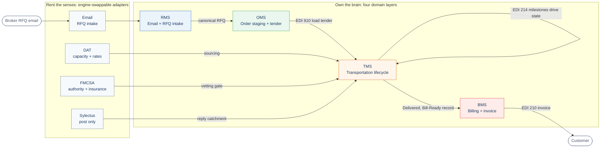
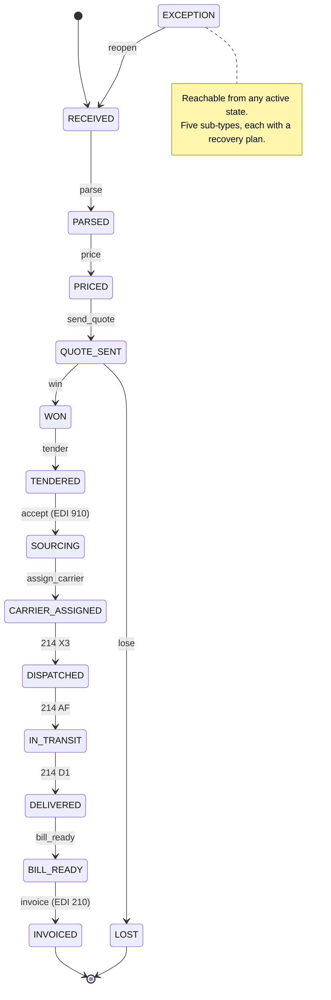

# ShipCES Autonomous Brokerage - architecture

Traced to [ADR-001](../adr/ADR-001-four-layer-architecture.md) and the canonical
lifecycle in `services/oms/src/schema/shipment.v1.ts` (`LIFECYCLE_STATES`). The
principle is "own the brain, rent the senses": the four domain layers hold the
logic; the Sense Layer adapters are engine-swappable senses.

## Layered view (own the brain, rent the senses)

Each layer maps to a workspace package: `services/rms`, `services/oms`,
`services/tms`, `services/bms`, and `services/adapters` (the Sense Layer, one
contract per [ADR-002](../adr/ADR-002-adapter-contract-pattern.md)). The OMS
holds the single source of truth (the canonical shipment record); each layer
owns transitions only within its own state subset.

## Lifecycle state machine (the canonical shipment record)

The 15 states below are `LIFECYCLE_STATES` verbatim. OMS owns RECEIVED..TENDERED,
TMS owns SOURCING..DELIVERED, BMS owns BILL_READY..INVOICED. Every transition is
audited.

## Handoff contracts (the layer seams)

| Seam | Trigger | Artifact | Owning code |
|---|---|---|---|
| RMS to OMS | RFQ won | canonical RFQ + email hash | `services/oms/src/handoff.ts` |
| OMS to TMS | WON to TENDERED | EDI 910 load tender | `services/oms/src/tender.ts` |
| TMS internal | milestone codes | EDI 214 (X3, AF, D1) | `services/tms/src/milestones.ts` |
| TMS to BMS | DELIVERED | Bill-Ready record | `services/tms/src/handoffBms.ts` |
| BMS to customer | Bill-Ready billed | EDI 210 invoice | `services/bms/src/invoice.ts` |
